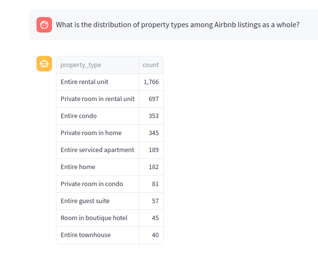
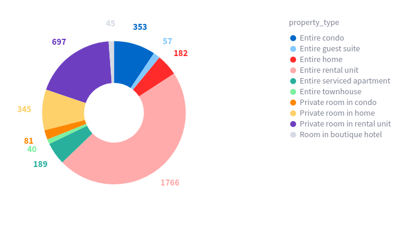

# DataDialog

**This application will give you a chat interface to gather insights on your own enterprise data & visualize them effectively, Simply ask Questions in plain English. The dataset used is airbnb.**

## Tools & Frameworks
- OpenAI
- Langchain
- Streamlit
- Visualizations - Altair
- Database - SQLite


## Overview of Application

1. Create a Streamlit UI interface
2. Construct Raw SQL Query using Langchain SQL Agent
3. Fetch data from sqlite DB with SQL query
4. Identify Visualization type by with user query and SQL query using visualizer prompt
5. Plot the Visualization


## Example Questions on Airbnb Dataset
1. How many Total listings do we have?
2. How many Total hosts do we have?
3. What is the average number of reviews for listings?
4. What is the distribution of top 10 property types among Airbnb listings as a whole/
5. Give the total bedrooms wise total listings
6. Give number of listings that are available and are unavailable for each day between July 1st to July 10th, 2023
7. What is the average price for Airbnb listings in different neighborhoods?
8. What are 5 least Avg. cost per accomodate property types
9. Top 10 hosts with highestTotal Revenue(revenue is calculated as the sum of the price for the listings which hacve false in the availlibility) from the booking between July 1st and Sept 30th 2023
10. Provide neighborhoods Wise - License Type(consider "No License" if the license is null, if the license contains the word "Exempt" then "License exempted", else give "Licensed" as License Type ) Wise Listing counts


## Application





## To run application on your local server
```commandline
git clone https://github.com/nxtwave-tech/DataDialog/
```
Make sure you run the below commands in virtual environment..
```commandline
pip install -r requirements.txt
```
```commandline
streamlit run main.py
```
